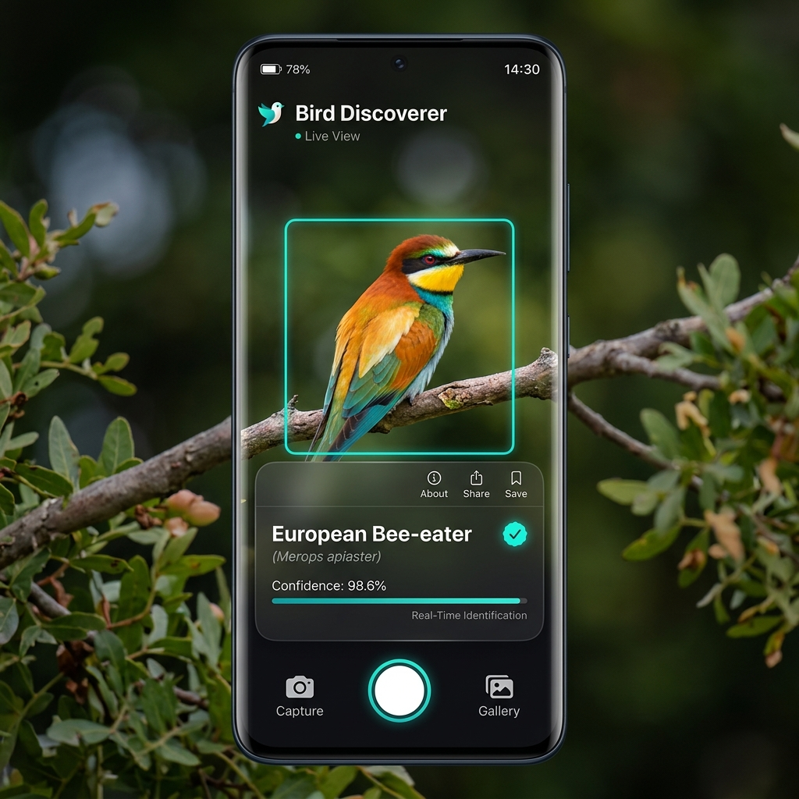

# Bird Discoverer 🐦

An advanced, real-time mobile application built for Android that detects, tracks, and classifies bird species dynamically from the camera stream using Machine Learning.



---

## 🌟 Key Features

*   **Real-time Object Detection & Tracking**: Utilizes **Google ML Kit Object Detection** to localize and track birds in the live camera feed.
*   **Deep Learning Classification**: Integrates a **TensorFlow Lite (LiteRT) model** (`birds_V1.tflite`) that performs fine-grained classification across 965 bird species.
*   **Automatic & Manual Capturing**: 
    *   *Auto-Capture*: Automatically saves sightings that meet a custom confidence threshold (with smart debouncing to prevent duplicates).
    *   *Manual Capture*: Snap a sighting photo manually by tapping the shutter button when a bird is in focus.
*   **GPS Tagging**: Integrates the **Google Play Services Fused Location Provider** to tag each sighting with geographical coordinates.
*   **Sightings History**: Persists captured sightings (photo crop, timestamp, species details, confidence, and location) in a local **SQLite** database.
*   **Modern Jetpack Compose UI**: Features a beautiful glassmorphic dark-themed layout with smooth animations, custom navigation, and quick detail sheet overlays.

---

## 🛠️ Technology Stack

*   **UI Framework**: Jetpack Compose (Kotlin-first declarative UI)
*   **Camera integration**: Android Jetpack CameraX (ImageAnalysis & Preview use cases)
*   **Local Database**: SQLite (SQLiteOpenHelper)
*   **Machine Learning**:
    *   Google ML Kit Object Detection API (Streaming Mode)
    *   TensorFlow Lite Support Library (ImageProcessor, TensorImage, and TensorBuffer)
    *   TensorFlow Lite interpreter (LiteRT)
*   **Image Loading**: Coil-Compose

---

## 📦 Getting Started

### Prerequisites
*   Android Studio (Ladybug or newer recommended)
*   Android SDK Platform 24 (Min SDK) to 36 (Target SDK)
*   JDK 17

### Installation
1. Clone the repository:
   ```bash
   git clone https://github.com/zeriouil/bird-discoverer.git
   cd bird-discoverer
   ```
2. Open the project in Android Studio.
3. Sync the Gradle files (`libs.versions.toml` specifies all dependencies, including Google LiteRT).
4. Run/Install the app on a physical Android device or emulator with camera support:
   ```bash
   ./gradlew installDebug
   ```

---

## 📂 Project Structure

```
app/src/main/
├── assets/
│   ├── birds_V1.tflite          # Core ML Model for Bird Classification
│   └── species_db.json          # Metadata database for Bird Species info
├── java/com/example/test/
│   ├── MainActivity.kt          # App entry point, lifecycle hooks & settings
│   ├── data/
│   │   ├── CaptureDatabaseHelper.kt # SQLite database helper for captures
│   │   └── ClassifierRepository.kt  # TFLite model runner & species database loader
│   ├── ml/
│   │   └── FrameAnalyzer.kt         # Custom ImageAnalysis.Analyzer linking ML Kit & TFLite
│   └── ui/
│       ├── DetectorScreen.kt        # Real-time camera preview & canvas overlays
│       ├── HistoryScreen.kt         # Sightings database record list
│       ├── SettingsScreen.kt        # User settings (Confidence threshold, camera select)
│       └── SpeciesInfoScreen.kt     # In-depth habitat & description info
```

---

## 📜 License
This project is licensed under the MIT License.
